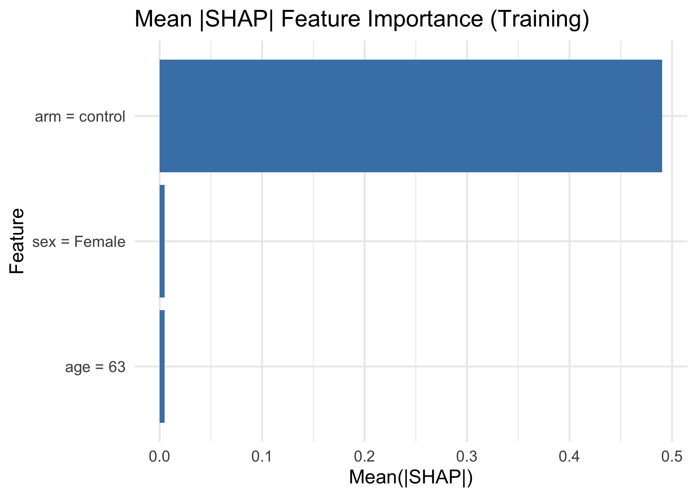
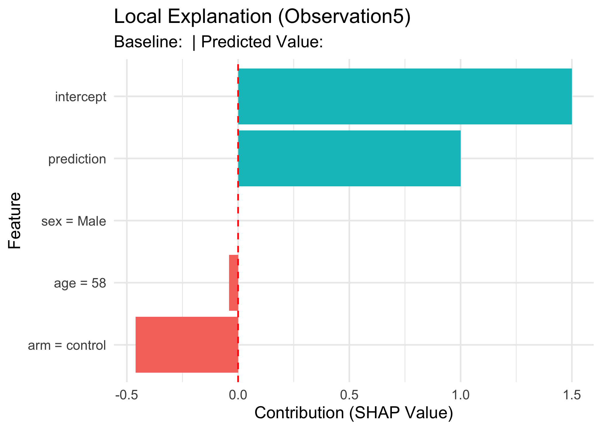

 
<h1 align="center">

Explainable AI (XAI) Toolkit for Model Interpretation (SHAP)

   

</h1>

------------------------------------------------------------------------

## 🧭 Overview

This **XAI Toolkit** is an interactive **R Shiny application** designed to provide deep insight into machine learning models using **SHapley Additive exPlanations (SHAP) values**. It is built on the robust `DALEXtra` framework and supports models trained for diverse tasks.

This tool helps  **Statisticians**, **data scientists**, and **researchers** to:

-   **Understand Model Behavior:** Determine which features drive predictions globally (Feature Importance) and locally (for single observations).

-   **Verify Stability:** Compare feature importance across training and validation datasets to identify potential data drift or overfitting.

-   **Support Diverse Models:** Seamlessly compute explanations for Regression, Binary Classification, and Survival/Time-to-Event models.

## 🚀 Features & Modes

| Explanation Type | Detail | Primary Output | Goal |
|------------------|------------------|------------------|------------------|
| **Global Importance** | Mean Absolute SHAP ( \| SHAP \| ) averaged across all observations. |
| **Local Explanation** | Breakdown of SHAP contributions for a single, selected observation. | Force Plot (Waterfall) / Details Table | Justifying an individual prediction. |
| **Stability Check** | Compares Global Importance rankings between training and validation data. | Correlation Heatmap / Delta Table | Identifying feature importance drift and unstable features. |

## 🔬 Core Methodology

### 🧠 SHAP Values

SHAP values attribute a prediction to each feature by calculating the feature's contribution to the difference between the actual prediction and the model's baseline (expected) prediction. The Mean \|SHAP\| serves as a powerful, model-agnostic measure of global feature importance.

### ⏳ Survival Prediction Handling

For **Survival** models (e.g., Cox PH, Random Survival Forests), the application automatically calculates the SHAP contribution based on the **Linear Predictor (Log-Hazard Ratio Proxy)**, making the time-to-event outcomes interpretable in terms of increased or decreased risk.

### ⚖️ Stability Analysis

When a validation dataset is provided, the tool computes:

1.  **Spearman Correlation (ρ):** The rank correlation between the Mean \|SHAP\| values of the train and validation sets. A low correlation indicates potential feature importance instability.

2.  **Absolute Difference (Δ):** Identifies features with the largest absolute difference in Mean \|SHAP\| magnitude between the two datasets.

## 🖥️ User Interface

### 🔹 Model Explanation Tools (Control Panel)

Users control the XAI workflow here:

-   **Upload Validation Data (optional):** Enables the Stability Check mode.

-   **SHAP Mode:** Toggle between `Single Dataset` (Train only) and `Compare Train vs Validation`.

-   **Compute SHAP / Importance:** Triggers the underlying `DALEX` computation.

-   **Select Explanation Type:** Switches between `Global Importance` and `Local Explanation (Force Plot)`.

-   **Select Observation:** (Local Mode only) Allows selection of the specific row ID for the Force Plot visualization.

### 🔹 Outputs Panel

The primary output section displays the visualization based on the selected mode:

  
  
  <em>Global Importance Plot: Mean \|SHAP\| ranking.</em>

  
  
  <em>Local Explanation Plot (Force Plot) for a single observation.</em>

Outputs also include the **Feature-Level SHAP Summary Table** (raw data) and, in `Compare` mode, the **Feature Importance Stability Correlation Plot** and a table of the **Top Unstable Features**.

  
<a href="https://npenn.shinyapps.io/PSClinical/" target="_blank">Link to App</a>
